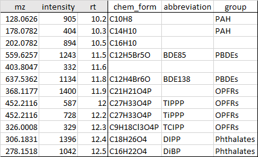

## File input

The input data of the features from processed mass spectrometric data should be in a “.csv” file format. The uploaded csv file have to contain three obligatory columns with the exact names: mz,rt and intensity. These correspond to the mass to charge (m/z), retention time and intensity of the features. Direct infusion experiments without retention time data can use dummy numeric input such as 1 in the rt column. Note that the column names cannot not contain any spaces. Here is the screenshot of a demo csv file:

 

However, besides the three compulsory columns, the user can freely input their own variables in the csv file. This could further exploit the powerful features of the MDPlotR and also allows the users to tailor their input data from their needs and available information. The user can freely name these variables but these should comply with the naming requirement of R, i.e variable names must start with a letter, and can only contain “letters”, “numbers”, “ _ “ (snake case) and “ . ” (dot). 

Examples could be chemical_formula for those features that have been assigned a chemical formula, chemical_group to group different identified compounds into different classes, e.g. PAHs, PCBs, fatty acids, steroids, etc. You should keep the names short in order avoid long columns that takes up space in your datatable.

After uploading the csv data, input the mass defect (MD) base in the input box(es) and click plot to show the MD plots. You can input two different MD bases that will be calculated separately and shown as “MD1” and “MD2” in the variable selection and in the datatable. 

To input a second order base, insert a comma directly after the first base without any space. Examples are given below. If you input a second order MD base, then the output variables will be “MD1_1” for the first order base and “MD1_2” for the second order base.

When you make changes on the left panel, you need to click the Plot button to update the plots and datatable. You should now be able to freely explore your dataset interactively using the input MD bases together with the plots and datatable.

## Equation

- Mass defect:

$$Mass\ defect = measured\ mass - round(measured\ mass)$$

- Relative Mass defect

$$Relative\ Mass\ defect = (measured\ mass - round(measured\ mass))/measured\ mass * 10^6$$

- Unit based first order mass defect

$$ Unit\ based\ first\ order\ mass = measured\ mass * round(first\ order\ unit\ exact\ mass)/first\ order\ unit\ exact\ mass $$

$$ First\ order\ mass\ defect = Unit\ based\ first\ order\ mass - round/floor/ceiling(Unit\ based\ first\ order\ mass) $$

- Unit based second order mass defect

$$ Unit\ based\ second\ order\ mass = First\ order\ mass\ defect (unit 1)/First\ order\ mass\ defect (unit 2) $$

$$ Second\ order\ mass\ defect = Unit\ based\ second\ order\ mass - round/floor/ceiling(Unit\ based\ second\ order\ mass) $$

- Unit based third order mass defect

$$ Unit\ based\ third\ order\ mass = Unit\ based\ second\ order\ mass (unit 1, unit 2)/Unit\ based\ second\ order\ mass(unit 2,unit3) $$

$$ Third\ order\ mass\ defect = Unit\ based\ third\ order\ mass - round/floor/ceiling(Unit\ based\ third\ order\ mass) $$

Examples of chemical formula in the MD formula insert box:

- $CH2$:  corresponds to one MD base unit, in this case a methylene unit, corresponding to the exact mass of 14.01565.

- $Cl-H$: calculates the addition of one Cl atom and subtraction of one H atom, corresponding to the exact mass of 33.96103. Use the minus sign “-“ to separate the base units. This app only support two different unit.

- $CH2,H2$: specifies that $CH_2$ is the first-order MD unit and $H_2$ is the second-order MD unit, use comma without blank space to separate them. This app only support at most three-order mass defect units.

- $CH2,Cl-H$:  specifies that $CH_2$ is the first-order MD unit and $Cl-H$ is the second-order MD unit. Use comma without blank space to separate the units.

